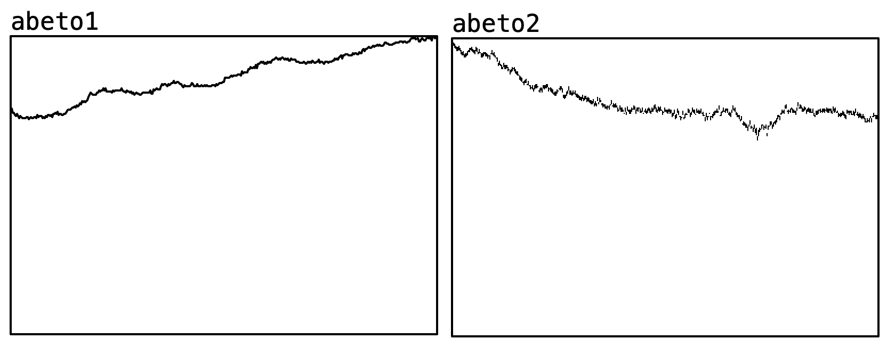
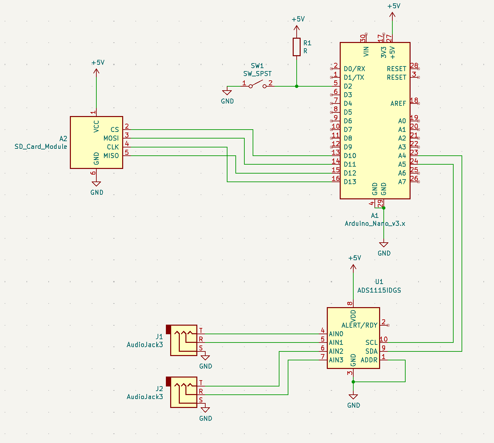

# Árboles ciudadanos

Bitácora de datos del proyecto creado por [@organismo.teatro](https://www.instagram.com/organismo.teatro/), en el que a partir de reflexionar sobre los árboles urbanos, se propone un proyecto de exploración metafórica utilizando la escritura y la sonificación de datos. 

Este repositorio contiene el código del microcontrolador utilizado, el esquemático utilizado (un ADC utilizado en modo amplificador de instrumentación) y los datos recogidos desde la tercera etapa (Parque Quinta Normal)

## Árboles registrados

### 15 de agosto de 2024 - Parque Quinta Normal

Abeto

Araucaria

Encinos (dos ejemplares)

Magnolios (dos ejemplares)

### 21 de agosto de 2024 - Parque Quinta Normal

Alcornoque

Olmos (dos)

Quillay

### 28 de agosto de 2024 - Parque Quinta Normal

Palmeras (dos)

Platano oriental 

### 4 de abril de 2025 - Centro Cultural Ailanto

Ailanto 

## Sonificaciones

Las sonificaciones fueron realizadas primero a través de un proceso utilizando el software Pure Data, a través de el cuál se transforman los datos en notas midi. Estos eran recibidos por Ableton Live, en el que primero los datos se ordenaron, cuantizaron, y se le aplicaron efectos midi de afinación a ciertas escalas, para luego incorporar sonidos, ajustando los rangos para que no se dispararan fuera del rango de cada instrumento. 

La decisión de la sonoridad de cada árbol correspondía a criterios metafóricos y especulativos, basándose en palabras clave que utilizaría Emerson Velasquez (director del proyecto y dramaturgo) para la redacción de los guiones. Por ejemplo, algunos se asociaban a la muerte, otros conjuntos de árboles a la noción de comunidad, etc. Mort Garson fue la principal referencia estilística para el trabajo con sonidos electrónicos

## Esquemático

